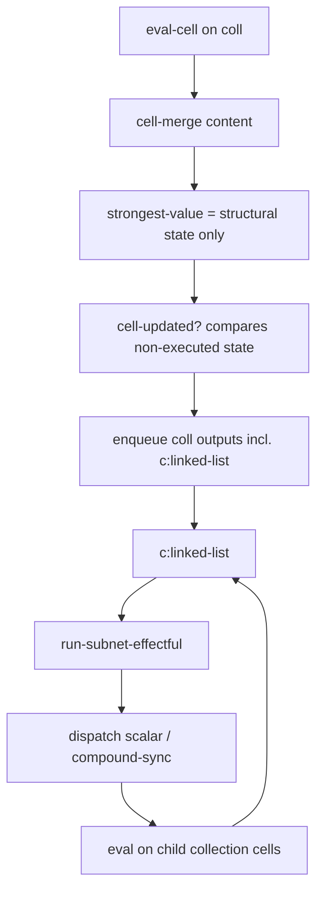

# Compound Data Design Draft

This document describes the `compound_data` design: extension-map compound state, compound-to-compound sync merge, and **linked-list-only** effectful execution.

## Goal

Represent linked lists as propagator constraints where:

- collection cells hold compound network state (structure only in content/strongest)
- `p:car` / `p:cdr` are structural writers (no read accessors)
- `c:linked-list` is the **only** place that runs the internal subnet and dispatches outward
- nested depth is **multi-hop dispatch** (`coll0` → `coll1` → …), not Lisp-style read propagators

## Data model

Compound **content** and **strongest** are the same shape: network extension maps (`:graph`, `:env`, `:dict`) plus:

- `:out-ids` — outer slot ids tracked for dispatch (default `#{}`)

Effectful runs produce a transient **continuation** (only inside `c:linked-list`, not stored on the cell):

- `:updated*` — atom of outer ids changed in that run

```clojure
(defn state-subnet [state]
  (dissoc state :out-ids :updated*))

(defn continuation-subnet [continuation]
  (dissoc continuation :out-ids :updated*)
```

## Runtime flow (execution boundary)



1. `p:car` / `p:cdr` emit `compound-update` (`{:head id}` / `{:tail id}`).
2. `cell-merge :compound-data` updates compound state (`merge-compound-data`) — **no run**.
3. `strongest-value :compound-subnet` returns content unchanged (structural state).
4. `cell-updated? :compound-subnet-state` compares old/new structural state (subnet + `out-ids`), not post-run avatar values.
5. `c:linked-list` reads **content**, calls `run-subnet-effectful`, dispatches each id in `@updated*`:
   - element target → scalar strongest message
   - compound target → `compound-sync` payload

### Why early run in `strongest-value` broke nesting

Previously `eval-cell` ran the internal subnet in `strongest-value` and stored a `SubnetContinuation` on the cell; `c:linked-list` only read that pre-baked result. Execution happened before the constraint boundary, so deep layers did not reliably follow merge → run → dispatch → child merge → child run.

Moving execution into `c:linked-list` restores hop-by-hop export from internal to external network.

## Compound-to-compound merge contract

`compound-sync` carries source subnet and slot frontier. `cell-merge :compound-sync` → `merge-compound-sync`:

- walk mergeable slots
- install missing graph/env/dict entries
- merge cell content via `cell-merge`
- propagator mismatch at same slot → contradiction

`dispatch-target?` does not filter compound cells; routing is by payload type.

## Nested dispatch (no read accessors)

Intentional model:

- No `p:read-car` / `p:read-cdr`; navigation is dispatch-only.
- `(car (cdr (cdr coll0)))` means chained `c:linked-list` on nested collections, not one-shot projection from `coll0`.

### Verification (linked-list-only spike)

| Test | Result |
|------|--------|
| Flat list dispatch | Pass |
| `coll0` only, head0 seeded, head2 not reached | Pass (`p-cons-five-access-from-coll0-only-does-not-reach-head2`) |
| head2 seeded, run `coll0` only — chain reaches head2 | Pass (`p-cons-five-chain-from-coll0-reaches-head2-when-seeded`) |
| head2 seeded, run `head2` — local control | Pass |

Honest setup: deep heads are not pre-seeded on the outer network when testing “coll0 alone” behavior.

## Run tests

```bash
clojure -M:test propagators-linked-list-access-test propagators-compound-data-test
```
