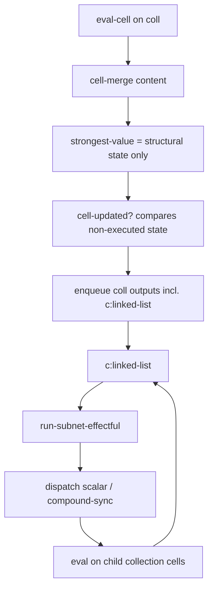

# Compound Data Design Draft

This document describes the `compound_data` design: extension-map compound state, compound-to-compound sync merge, and **linked-list-only** effectful execution.

## Goal

Represent linked lists as propagator constraints where:

- collection cells hold compound network state (structure only in content/strongest)
- `p:car` / `p:cdr` are structural writers (no read accessors)
- `c:linked-list` is the **only** place that runs the internal subnet and dispatches outward
- nested depth is **multi-hop dispatch** (`coll0` → `coll1` → …), not Lisp-style read propagators

## Data model

Compound **content** and **strongest** are the same shape: network extension maps (`:graph`, `:env`, `:dict`) plus:

- `:out-ids` — outer slot ids tracked for dispatch (default `#{}`)

Effectful runs produce a transient **continuation** (only inside `c:linked-list`, not stored on the cell):

- `:updated*` — atom of outer ids changed in that run

```clojure
(defn state-subnet [state]
  (dissoc state :out-ids :updated*))

(defn continuation-subnet [continuation]
  (dissoc continuation :out-ids :updated*)
```

## Runtime flow (execution boundary)



1. `p:car` / `p:cdr` emit `compound-update` (`{:head id}` / `{:tail id}`).
2. `cell-merge :compound-data` updates compound state (`merge-compound-data`) — **no run**.
3. `strongest-value :compound-subnet` returns content unchanged (structural state).
4. `cell-updated? :compound-subnet-state` compares old/new structural state (subnet + `out-ids`), not post-run avatar values.
5. `c:linked-list` reads **content**, calls `run-subnet-effectful`, dispatches each id in `@updated*`:
   - element target → scalar strongest message
   - compound target → `compound-sync` payload

### Why early run in `strongest-value` broke nesting

Previously `eval-cell` ran the internal subnet in `strongest-value` and stored a `SubnetContinuation` on the cell; `c:linked-list` only read that pre-baked result. Execution happened before the constraint boundary, so deep layers did not reliably follow merge → run → dispatch → child merge → child run.

Moving execution into `c:linked-list` restores hop-by-hop export from internal to external network.

## Compound-to-compound merge contract

`compound-sync` carries source subnet and slot frontier. `cell-merge :compound-sync` → `merge-compound-sync`:

- walk mergeable slots
- install missing graph/env/dict entries
- merge cell content via `cell-merge`
- propagator mismatch at same slot → contradiction

`dispatch-target?` does not filter compound cells; routing is by payload type.

## Named Network Lattice

`propagators.datastructures.named-network` defines a fast preorder for
network-shaped values that have a non-empty `:dict`. This is an **interface
lattice**, not full graph equivalence:

- `:dict` keys are the named observable commitments.
- unnamed graph/env entries are treated as derivable implementation detail.
- `a >= b` means every named key in `b` is present in `a`, and each named entry
  in `a` subsumes the corresponding entry in `b`.
- named cells compare by their strongest values using the Bool4 preorder.
- named propagators compare by identity: the same named propagator must resolve
  to the same internal id; a different id for the same propagator name is a
  contradiction.

Cell merge for named networks follows the preorder:

| Case | Merge result |
|------|--------------|
| empty content + named-network update | singleton evidence set `#{update}` |
| `update >= old-evidence` | replace weaker old evidence with `update` |
| `old-evidence >= update` | keep old evidence (reject weaker update) |
| update incomparable with all old evidence | add update to the evidence set |
| same propagator name commits to incompatible ids/types | keep both in content; strongest becomes `contradiction` |

The content merge is intentionally conservative: it does **not** collapse
named-network evidence to contradiction. It normalizes named-network content to
an **evidence set** of named networks and maintains that set as an antichain:
stronger incoming evidence replaces weaker old evidence; weaker incoming
evidence is ignored; incomparable evidence is retained alongside the rest.
`strongest-value` computes the joined named-network view from that set. Disjoint
named commitments join by union; same named Bool4 cells join their strongest
values (so incompatible `true`/`false` become a named cell whose strongest is
`contradiction`); and conflicting named propagator identities make the
**strongest** contradiction, not the raw content. This lets compound/network
content behave like a lattice without pretending to solve anonymous graph
isomorphism or functional equivalence of propagators.

## Nested dispatch (no read accessors)

Intentional model:

- No `p:read-car` / `p:read-cdr`; navigation is dispatch-only.
- `(car (cdr (cdr coll0)))` means chained `c:linked-list` on nested collections, not one-shot projection from `coll0`.

## Linked-list access (verified in tests)

Source of truth: `test/propagators_linked_list_access_test.clj`. Scheduling experiments live in `test/propagators_linked_list_schedule_test.clj` (may include intentional failures).

### Wiring: `p:cons` spine + optional accessor writers

Per layer, `p:cons head tail coll` installs:

- `p:car` — `head` → `{:head head}` on `coll`
- `p:cdr` — `tail` → `{:tail tail}` on `coll` (nested spine: `tail` is `coll_{i+1}` or a sentinel)
- `c:linked-list` — runs subnet + dispatch when `coll` is updated

To model Lisp `(car (cdr (cdr coll0)))` at an outer cell `out`, tests add **extra writers** (still not readers):

```text
(p:cdr coll1 coll0)   ;; {:tail coll1} on coll0
(p:cdr coll2 coll1)   ;; {:tail coll2} on coll1
(p:car  out   coll2)  ;; export slot wired to coll2
```

plus `3 × p:cons` for the three layers. `out` is not reached by wiring `p:car`/`p:cdr` directly on `coll0`.

### When nested access works

Access succeeds when **all** of the following hold:

1. **Structure** — `p:cons` layers (and accessor `p:cdr` / `p:car` if modeling the full path).
2. **Values on element cells** — at least the deep head (e.g. `head2 = 30`); shallow-only seed does not reach deep slots.
3. **Writers run after values exist** — `p:car` / `p:cdr` must emit updates when inputs are non-`nothing`. In tests, `seed-cell!` / `seed-cells!` update the cell **and enqueue neighbor propagators**; bare `assoc-net-cell` does not schedule neighbors.
4. **Dispatch from the list root** — `run-from` with `coll0` (or `pop-inputs` on `coll0`) drives `c:linked-list` hop-by-hop through nested collections.

Minimal passing accessor scenario (`three-layer-cons-accessor-head2-seeded-run-coll0-reaches-out`):

- Install `p:cons` × 3 + accessor writers (lazy install; no tasks until seed/run helpers).
- `seed-cell!` on `head2` only → enqueue layer `p:car` (and related neighbors).
- `run-from` with pending accessor tasks + `pop-inputs [coll0]` → `out` strongest = `30`.

Full scenario seeds `head0` / `head1` / `head2` before running `coll0`.

### When it does not work

| Situation | Expected |
|-----------|----------|
| Seed only `head0`, run `coll0` | `head2` stays `nothing` — no shallow-to-deep shortcut |
| Extra `p:car` / `p:cdr` on `coll0` into a fresh `out` | `out` stays `nothing` — writers do not read the list |
| Enqueue `p:car` / `p:cdr` at `p:cons` **install** before seeding heads | Accessor path fails (`install-time-enqueue-accessor-reaches-out` in schedule test) |
| Enqueue cons writers **after** seed, then run `coll0` | Accessor path can pass (`defer-enqueue-until-after-seed-accessor-reaches-out`) |

Production implication: schedule `p:car` / `p:cdr` when **head/tail cells change**, not unconditionally at install. `p:cons-scheduled` in `compound_data.clj` exposes prop ids for harnesses only.

### Two propagation styles in the access suite

| Style | How values are set | How work runs |
|-------|-------------------|---------------|
| **Task-queue harness** | `seed-cell!` / `seed-cells!` enqueue neighbors | `run-from` merges pending queue + `pop-inputs` |
| **Direct assoc** | `net/assoc-net-cell` on heads | `run-from` or `run-tasks` on `pop-inputs` only |

Both appear in tests. Chain export (`head2` seeded, run `coll0` only) uses direct assoc; accessor `out` tests use the `!` helpers.

### Dispatch locality

- Running from `head2` updates `head2` and structural state on `coll2`; it does **not** copy deep values onto `head0` (`car-cdr-cdr-dispatch-via-coll2-not-coll0`).
- Element updates: `out-ids` on a collection include element slots (e.g. `head2`), not the tail collection id (`c-linked-list-dispatches-to-element-not-nested-collection`).

### Access test matrix (`propagators-linked-list-access-test`)

| Test | Behavior |
|------|----------|
| `p-cons-five-then-access-via-cons-wired-car-cdr` | Local: seed `head2`, run `head2` → 30; `coll2` compound structural strongest |
| `p-cons-five-access-from-coll0-only-does-not-reach-head2` | Negative: seed `head0` only, run `coll0` → `head2` nothing |
| `p-cons-five-chain-from-coll0-reaches-head2-when-seeded` | Positive: seed `head2`, run `coll0` → `head2` = 30 via chain |
| `three-layer-cons-accessor-three-heads-seeded-run-coll0-reaches-out` | Accessor + all heads seeded → `out` = 30 |
| `three-layer-cons-accessor-head2-seeded-run-coll0-reaches-out` | Accessor + `head2` only → `out` = 30 |
| `p-cons-five-extra-car-cdr-from-coll0-not-access` | Negative: writers on `coll0` cannot read into `out` |
| `five-element-list-propagation-reaches-index-two` | Manual `p:car` + `c:linked-list` build; all heads seeded |
| `five-layer-p-cons-matches-manual-wiring` | `p:cons` × 5 matches manual wiring at index 2 |
| `car-cdr-cdr-dispatch-via-coll2-not-coll0` | Dispatch local to deep layer |
| `c-linked-list-dispatches-to-element-not-nested-collection` | `out-ids` excludes tail collection |

## Run tests

```bash
# Main linked-list access behavior
clojure -M:test propagators-linked-list-access-test propagators-compound-data-test

# Scheduling experiments (install-time enqueue may fail)
clojure -M:test propagators-linked-list-schedule-test
```
