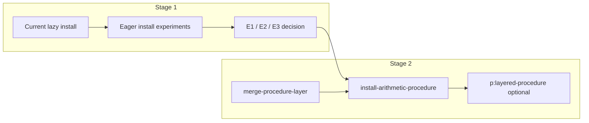

# Eager Install Activation and `install-arithmetic-procedure`

Status: **design / experiment plan** (not implemented).

Related:

- [Layered Procedure Network](layered-procedure-network.md) — current extension-cell + `p:layered-procedure` model
- [Core Runtime Model](core-runtime.md) — installers, scheduler, compile surface
- [Compound Object Slot Sync](compound-object-slot-sync.md) — precedent for eager vs lazy enqueue in tests

Source files this plan touches:

- `propagators/compile.clj` — `eval-application`, `run-net-let`, macros
- `propagators/network_builder.clj` — `install-propagator!`, `seed-cell!`, `run-propagators`
- `propagators/layered.clj` — `p:layered-procedure`, `p:apply-layered`
- `propagators/stdlib/arithmetic.clj` — extension fragments (target home for stage 2)
- `test/propagators_layered_procedure_test.clj` — heaviest manual `run-propagators` today

## Problem Statement

Layered arithmetic procedures today require a **multi-step bootstrap** per operator:

1. Allocate `proc` and per-layer extension cells.
2. Install `p:layered-procedure` wiring extension → `proc`.
3. **Seed** each extension cell with a named-network fragment.
4. **Run** those propagators so merge into `proc` happens.
5. Only then install `layered/+` (or similar) and run apply.

That is correct for **reactive** extension (fragment lives in another cell), but it does not scale as the default way to define stdlib `+`, `-`, `*`, `/`.

The proposed direction:

- **Stage 1** — Learn whether making install paths **eagerly activate** newly installed propagators (and possibly seeds) preserves semantics and removes manual `run-propagators` ceremony.
- **Stage 2** — Use that mechanism to define **`install-arithmetic-procedure`** as a **one-shot installer** that merges base (+ optional provenance) into `proc` in one install/run cycle, without permanent extension-cell subgraphs for the common case.

---

## Stage 1: Eager Activation Experiment

### 1.1 Current behavior (baseline)

| Surface | On install | On seed (`eval-seed` / `nb/seed-cell`) | Prop ids recorded? |
|---------|------------|----------------------------------------|--------------------|
| `((installer …) net)` | Topology + prop in `env` only | Updates cell; **does not** enqueue neighbors | N/A |
| `compile/eval-application` | Same as above | — | Yes, in `ctx :props` |
| `compile/run-net-let` | Same | Seeds in `cell-binds` only | No central prop list |
| `nb/install-propagator!` | Install + **enqueue** that prop | — | — |
| `nb/seed-cell!` | Seed + **enqueue** neighbor props | — | — |
| `nb/run-propagators` | — | — | Explicit batch run |

So today:

- **Installers and compile macros are lazy**: wiring is declarative; effects happen only when the caller runs the scheduler.
- Tests and layered procedure helpers **manually** call `nb/run-propagators` on a collected prop list (see `install-plus-procedure` in `propagators_layered_procedure_test.clj`).

`p:apply-layered` is different: it **already** runs its application subnet to quiescence inside activation (`nb/run-propagators` on inner props). That is eager **inside** one propagator, not at the compile/install layer.

### 1.2 Definition: “eager activate”

For this plan, **eager activate on install** means:

> After `((installer arg …) network)` returns `[prop-id network']`, immediately enqueue `prop-id` on a task queue and run the scheduler until that propagator’s activation completes (single-prop step or drain-to-quiescence — see open choice below).

Optional extensions (same stage, separate flags):

- **Eager on seed** — `seed` in compile also calls `seed-cell!` semantics (enqueue neighbors of seeded cell).
- **Eager on `eval-application` only** — layered compile tests use `eval-layered`; default `eval-net` stays lazy for backward compatibility.
- **Drain policy** — `enqueue-one` vs `run-tasks` until empty after each install (affects order when a `do` installs many props).

### 1.3 Hypotheses to test

| ID | Hypothesis | If true | If false |
|----|------------|---------|----------|
| H1 | Eager install of `p:layered-procedure` after `seed` in the same `do` removes need for separate `run-propagators` on procedure props | Stage 2 can rely on compile `do` ordering | Need explicit merge primitive or ordered multi-run |
| H2 | Eager install before seed does **not** merge extensions (prop sees unusable extension) | Document required order: seed before install, or install-then-seed-then-run-neighbors | Must always run after full `do` |
| H3 | Eager activation is **not** required for `p:car` / `p:cdr` accessor chains (matches slot-sync doc) | Tests can drop `install-prop!` convenience | Eager is semantically necessary for compound access |
| H4 | Eager per-install quiescence commutes with manual batch `run-propagators` for independent props | Safe default for compile | Need deterministic install order spec |
| H5 | Nested / compound activations do not double-run or loop when install eagerly fires inner work | Eager safe for `p:apply-layered` path | Restrict eager to “bootstrap” propagator class only |

### 1.4 Experiment matrix (implementation probes)

Implement behind a **feature flag** or parallel API (do not change default behavior until stage 1 completes).

#### Probe A — `nb/install-propagator-eager!`

```clojure
;; conceptual
(defn install-propagator-eager!
  [n installer {:keys [drain?] :or {drain? :one}}]
  (let [[prop-id n'] (install-propagator n installer)]
    (case drain?
      :one (run-propagators n' [prop-id])
      :quiesce (run-tasks-until-empty n' (enqueue prop-id)))))
```

**Tests:** replay existing `propagators-layered-procedure-test` with eager install replacing manual `run-propagators` on procedure props; compare `proc` slot contents and apply results.

#### Probe B — `compile/eval-application` eager mode

Add optional parameter or dynamic var, e.g. `*eager-install?*`:

```clojure
;; after ((apply installer argv) (:net ctx'))
(when *eager-install?*
  (assoc ctx :net (nb/run-propagators n' ids)))
```

**Tests:** same layered tests via `eval-layered` with flag on; ensure `do` + `seed` + `layered/p:layered-procedure` ordering matches H1/H2.

#### Probe C — `run-net-let` / `net-let` eager mode

Mirror Probe B for `run-net-let` used in runtime builders.

#### Probe D — seed eager

When `eval-seed` runs under eager flag, use `seed-cell!` and optionally drain neighbor queue.

**Tests:** compound object tests that currently seed then run; named-network bi-sync tests.

### 1.5 Ordering rules (must document outcomes)

For a `do` block like the test helper:

```clojure
(do
  (layered/p:layered-procedure proc extension)
  (seed extension extension-value))
```

| Order | Extension strongest when prop runs | Expected merge into `proc` |
|-------|-----------------------------------|----------------------------|
| Install prop, eager run **before** seed | unusable | **no merge** |
| Seed, then install prop, eager run | fragment present | **merge** |
| Install prop (lazy), seed, eager run neighbors | fragment present | **merge** (if neighbor enqueue includes `p:layered-procedure`) |
| Install prop (lazy), seed, batch `run-propagators` | fragment present | **merge** (today) |

Stage 1 deliverable: a table of **which eager variant** reproduces today’s behavior without extra manual runs.

### 1.6 Risks and mitigations

| Risk | Mitigation |
|------|------------|
| Install order sensitivity | Spec: compile `do` is sequential; eager uses that order; document required patterns |
| Re-entrancy / nested `run-tasks` while outer prop still activating | Cap eager drain to `:one` for bootstrap props; keep `:quiesce` for inner subnets only where already used |
| Performance: install N props → N scheduler drains | Batch mode: install all props in `do`, single drain at end (variant **eager-batch**) |
| Contradiction / partial values fire too early | Propagators already skip unusable inputs; verify no new messages on `nothing` |
| Hidden global mutation feeling | Eager still returns **new** `network` value; document as “install + evaluate one step” |
| Breaking lazy callers that relied on inspecting unwired-strongest topology | Default stays lazy; eager opt-in or `install-*!` naming |

### 1.7 Stage 1 success criteria

Stage 1 is **done** when we can answer yes/no with tests:

1. **Equivalence:** For `propagators-layered-procedure-test`, an eager policy reproduces all assertions with **no** `nb/run-propagators` on procedure extension props in test helpers.
2. **Ordering:** Documented minimal pattern for “install arithmetic layers onto `proc`” via eager compile or eager install+seed.
3. **No regression:** `propagators-network-test`, `propagators-compound-object-test`, and compound slot-sync tests pass under chosen default (likely still lazy globally).
4. **Decision record:** Pick one of:
   - **E1** — per-install eager (compile flag),
   - **E2** — end-of-`do` / end-of-`eval-net*` batch eager,
   - **E3** — keep compile lazy; only new installers use `install-propagator!` style.

Recommendation to decide in stage 1: prefer **E2 (batch at end of sequential install block)** for macro ergonomics, and **E3** for explicit stdlib installers — avoids N drains per `do` line.

### 1.8 Stage 1 work checklist

1. Add `propagators/doc` experiment notes section in test output (or small `test/propagators_eager_install_test.clj`).
2. Implement Probe A + Probe B behind flags.
3. Port **one** layered test (`apply-layered-computes-base-and-provenance`) to eager path; compare `proc` and `out` objects to baseline.
4. Port **extension-order** test (`layered-operator-reuses-and-observes-procedure-extension`) — must still pass lazy; eager must not break “define `p:+` before provenance exists”.
5. Run compound accessor test with and without eager install in accessor chain (validate H3).
6. Write decision: E1 / E2 / E3 + seed eager yes/no.
7. Update [layered-procedure-network.md](layered-procedure-network.md) with “bootstrap vs reactive” subsection pointing here.

---

## Stage 2: `install-arithmetic-procedure` (after Stage 1)

Stage 2 **depends** on stage 1’s chosen eager policy. It does not replace `p:layered-procedure`; it replaces **extension cells + manual seed + manual run** as the default stdlib bootstrap.

### 2.1 Design target

| Piece | Role |
|-------|------|
| `merge-procedure-layer` | Pure primitive: `network × proc-id × layer × fragment → network` (same merge cell messages would produce) |
| `install-arithmetic-procedure` | Installer: `(op proc-id opts?) → propagator-installer` **or** direct network fn |
| `p:layered-procedure` | Optional **reactive** path when fragment originates from another cell |
| `layered/+`, `layered/-`, … | Unchanged: close over `proc-id` only |

**One-shot propagator reading (preferred if stage 1 E3 or E2 works):**

```clojure
;; conceptual API in propagators.stdlib.arithmetic or propagators.layered
(defn install-arithmetic-procedure
  "Installer returning propagator that merges stdlib arithmetic layers into proc-id.
   Arity: [proc-id] or [op proc-id] with op in #{:+ :- :* :/}."
  [op proc-id & {:keys [provenance?] :or {provenance? true}}]
  (fn [network]
    (prop/construct-propagator
      (fn [_in _out n]
        ;; use merge-procedure-layer for :base and optional :provenance
        ;; return messages or direct net update per stage-1 merge primitive
        ...)
      []    ;; or [spec-cell] if op comes from network
      [proc-id])))
```

**Usage sketch:**

```clojure
(def plus-proc (new-node-id))
(def [bootstrap-prop net]
  ((install-arithmetic-procedure :+ plus-proc) net))
;; stage 1 eager: no extra run-propagators here
(def p+ (layered-ops/+ plus-proc))
```

`install-arithmetic-procedure` is a **wrapper**: activate body calls `merge-procedure-layer` (pure). The propagator exists to participate in the uniform scheduler and stage-1 eager install policy.

### 2.2 Mapping ops → fragments

| Op | Base fragment | Provenance fragment |
|----|---------------|------------------------|
| `:+` | `base/plus-closure` | `provenance/+` |
| `:-` | `base/minus-closure` | `provenance/-` |
| `:*` | `base/times-closure` | `provenance/*` |
| `:/` | `base/divide-closure` | `provenance//` |

Reuse existing `arithmetic/plus-base-extension`, `minus-base-extension`, etc., or inline `procedure-extension` + closure — **no new layer semantics**.

### 2.3 Idempotency and “one-time”

| Mode | Behavior |
|------|----------|
| **Idempotent merge** (default) | Re-running bootstrap prop is no-op if fragment already subsumed |
| **One-shot disarm** (optional) | After successful merge, prop activation returns `[]` forever — only if needed for graph size |

Default: **idempotent** + single install at definition site; matches “installer runs once” without removing props from graph.

### 2.4 Late extension (unchanged story)

Tests that require “`layered/+` before provenance exists, extend later” keep:

- `merge-procedure-layer` for direct late update, **or**
- `p:layered-procedure` + extension cell when the layer is **driven** from elsewhere in the graph.

Stage 2 tests:

- Refactor `install-plus-procedure` test helper → `install-arithmetic-procedure :+`.
- Keep one test on **reactive** `p:layered-procedure` path to ensure we do not delete capability.

### 2.5 Stage 2 implementation checklist

1. Implement `merge-procedure-layer` using same message/merge path as `p:layered-procedure` (extract shared fn from `layered.clj` if needed).
2. Implement `install-arithmetic-procedure` installer using stage-1 eager policy.
3. Wire into `compile` installer map as `'install-arithmetic-procedure` (optional macro sugar).
4. Slim `propagators_layered_procedure_test.clj` helpers; remove duplicate `install-plus/minus/divide-procedure`.
5. Update [layered-procedure-network.md](layered-procedure-network.md) example flow to show bootstrap installer as primary, extension cells as reactive alternative.
6. Add one compound-object test using bootstrap installer instead of manual layered-plus wiring (if not redundant).

### 2.6 Stage 2 success criteria

1. Defining `+` with base + provenance is **one installer call** on `proc` (+ stage-1 eager, no manual prop list).
2. All existing `propagators-layered-procedure-test` assertions pass.
3. `layered/+` installer unchanged; no `p:layered+` revival.
4. Documented public API in stdlib arithmetic namespace; deprecated barrel does not re-export bootstrap installer (leaf require only).

---

## Relationship Between Stages



**Do not** implement stage 2 bootstrap until stage 1 answers H1–H5 and picks E1/E2/E3. Otherwise we risk encoding the wrong scheduling policy into stdlib.

---

## Open Questions (resolve in Stage 1)

1. Should `merge-procedure-layer` be public in stage 2 even if bootstrap is propagator-based? **Suggested:** yes — pure fn for tests and direct REPL updates.
2. Does `eval-seed` need eager neighbors for bootstrap, or only eager install of bootstrap prop after internal seed? **Likely:** bootstrap prop owns merge internally → no extension cells → seed only inside activate.
3. Should `install-arithmetic-procedure` merge synchronously inside activate without returning messages? **Allowed** if it returns updated network through compound message path; must match immutable network story.
4. Compile `do` batch eager (E2): run once after full procedure install block — is that sufficient for `install-arithmetic-procedure` implemented as **two** internal merges (base + provenance) in one propagator? **Expected yes** if one propagator activate does both merges.

---

## Summary

| Stage | Goal | Output |
|-------|------|--------|
| **1** | Experiment eager activation for installers / compile / macros | Policy E1/E2/E3 + tests proving equivalence and order rules |
| **2** | `install-arithmetic-procedure` as one-shot bootstrap over `proc` | Less test ceremony; reactive `p:layered-procedure` retained for late/external layers |

The user-facing win is not “fewer concepts” but **one default bootstrap path** that scales with the network: install arithmetic behavior onto `proc` the same way you treat other cell updates, with propagator installers optionally running immediately under a well-defined eager policy learned in stage 1.
